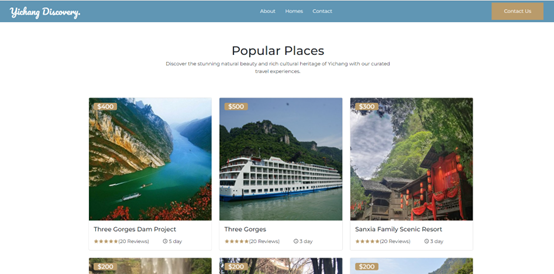
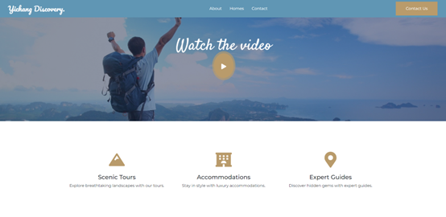

# Yichang Travel Booking Website - Front End
The front-end of this travel booking website for Yichang city is built using the latest web technologies such as HTML, CSS, JavaScript, Bootstrap and Reactjs. This README provides instructions for getting started with the project.

## Screenshots
|

|

## Getting Started
These instructions will help you get a copy of the project up and running on your local machine for development and testing purposes.

### Prerequisites
Before you start, you will need to have the following software installed on your machine:
Node.js (version 12 or later)
npm (version 6 or later)
### Installing
To install the project, follow these steps:
1. Clone the repository
2. Change into the project directory
3. Install the dependencies: 
```console
    npm install
```
### Running
To start the development server, run npm start in the project directory. 
```console
    npm start
```
This will start the server and open the app in your default web browser at http://localhost:3000.
### Building
To create a production build of the app, run npm run build. This will create an optimized build in the build directory.

## Built With
- HTML
- CSS
- JavaScript
- Bootstrap - The CSS framework used for styling
- React - The JavaScript library used to build the user interface
- React Router - The library used to handle routing.

## Disclaimer
This project is solely for demonstration purposes, and not intended for commercial use. 
