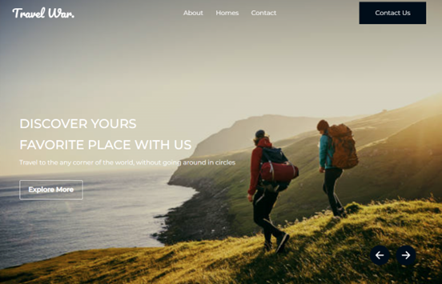
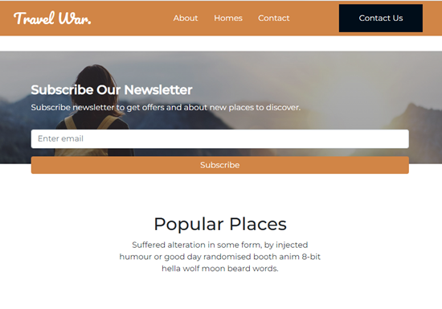
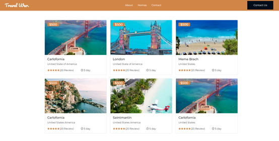

# Traval Booking Website front end 
The front-end of the website is built using the latest web technologies such as HTML, CSS, JavaScript, and Bootstrap.

## Screenshots
  |

  
## Getting Started

To get started with this project, follow these steps:

1. Clone the repository to your local machine:
2. Navigate to the project directory
3. Install the required dependencies
4. Start the development server
5. Open your web browser and visit `http://localhost:3000` to view the application.

Note: You may need to configure the project to suit your specific development environment, including setting up the appropriate database and API credentials.

## Built With
- HTML
- CSS
- JavaScript
- Bootstrap

## Disclaimer
This project is solely for demonstration purposes, and not intended for commercial use. 
