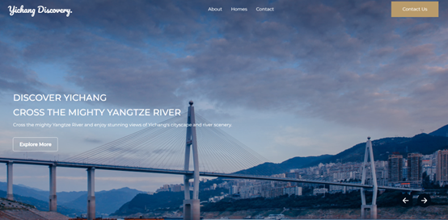

# Yichang Travel Booking Website - Front End

live version: https://yichang-travel.netlify.app/

Yichang Travel Booking Website is a platform designed to facilitate travel bookings for Yichang city, providing users with a seamless experience for planning and organizing their trips.

## Screenshots

|

|

## Getting Started

These instructions will help you get a copy of the project up and running on your local machine for development and testing purposes.

### Prerequisites

Before you start, you will need to have the following software installed on your machine:

- Node.js (version 12.0.0 or higher)
- npm (version 6.0.0 or higher)

If you don't have [Node.js](https://nodejs.org) and [npm](https://www.npmjs.com/get-npm) installed, you can download them from the official websites.

### Installing

To install the project, follow these steps:

1. Clone the repository
2. Change into the project directory
3. Install the dependencies:

```console
    npm install
```

### Running

To start the development server, run npm start in the project directory.

```console
    npm start
```

This will start the server and open the app in your default web browser at http://localhost:3000.

### Building

To create a production build of the app, run npm run build.

```console
    npm run build
```

This will create an optimized build in the 'build' directory.

## Built With

- HTML
- CSS
- JavaScript
- Bootstrap - The CSS framework used for styling
- React.js - The JavaScript library used to build the user interface

## Disclaimer

This project is solely for demonstration purposes, and not intended for commercial use.
